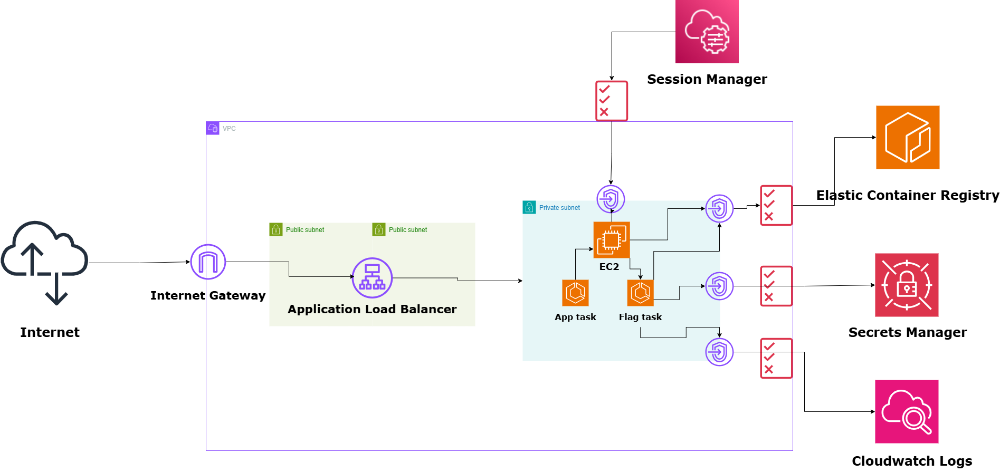

# SideDoor — A Chained Web-to-Cloud Privilege Escalation on AWS

A self-contained, deployable CTF environment built on AWS ECS that demonstrates a
real-world privilege escalation chain: a web application vulnerability leading to
cloud instance metadata theft, and a lateral pivot into a more privileged container.



## Overview

A vulnerable web app (Django + React) runs as an ECS task on a single, private EC2 instance, next to a second, more privileged task holding a secret it was never meant to reach. Nothing in the app hands that secret over directly. Getting to it means chaining a handful of top OWASP web vulnerabilities into something that reaches straight past the web app and into the cloud infrastructure underneath it.

**Objective:** gain access to the flag stored in AWS Secrets Manager.

No further hints here — see [Rules of Engagement](#rules-of-engagement) below
before you start.

## Tech Stack

- **Compute:** Amazon ECS (EC2 launch type, single node), Amazon Session Manager
- **App:** Django REST Framework + React (served as one container, Whitenoise)
- **Networking:** VPC with public/private subnet split, ALB, VPC PrivateLink
  endpoints (no NAT Gateway / no internet egress from the private subnet)
- **Secrets:** AWS Secrets Manager
- **IaC:** Terraform
- **Monitoring:** Cloudwatch

## Prerequisites

To deploy your own copy of this environment, you'll need:


- [Terraform](https://developer.hashicorp.com/terraform/install) >= 1.5
- [Docker](https://docs.docker.com/get-docker/)
- [AWS CLI v2](https://docs.aws.amazon.com/cli/latest/userguide/getting-started-install.html),
  configured with credentials (`aws configure`)
- [Session Manager plugin for the AWS CLI](https://docs.aws.amazon.com/systems-manager/latest/userguide/session-manager-working-with-install-plugin.html)

## Usage

### 1. Provision the infrastructure

```bash
git clone https://github.com/<your-username>/sidedoor.git
cd sidedoor

terraform init
terraform plan
terraform apply
```


### 2. Build and push the application image

```bash
REPO_URL=$(terraform output -raw ecr_repo_url)

docker build --platform linux/amd64 -t $REPO_URL:latest .
docker push $REPO_URL:latest
```

### 3. Build and push the flag-holder image

```bash
docker build --platform linux/amd64 -f flag.Dockerfile -t $REPO_URL:flag-base .
docker push $REPO_URL:flag-base
```

### 4. Force both services to deploy the newly pushed images

```bash
aws ecs update-service --cluster sidedoor-cluster --service sidedoor-app-service --force-new-deployment
aws ecs update-service --cluster sidedoor-cluster --service sidedoor-flag-service --force-new-deployment
```

Give it a minute or two, then confirm both are healthy:

```bash
aws ecs describe-services --cluster sidedoor-cluster --services sidedoor-app-service sidedoor-flag-service \
  --query 'services[].{name:serviceName,running:runningCount,desired:desiredCount}'
```

### 5. Access the app

```bash
terraform output alb_url
```

### Tearing down

```bash
terraform destroy
```

## Rules of Engagement

- This environment is intended to be attacked **only within your own deployed
  copy** of it, in your own AWS account.
- The objective is to retrieve the flag through the application and AWS APIs —
  not by reading the Terraform source, which would spoil the intended solve
  path.
- Estimated difficulty: intermediate. Familiarity with web application
  vulnerabilities, the AWS CLI, and basic IAM concepts is assumed.

## Writeup
---

Check [Walkthrough](Walkthrough.md)

---

## License

MIT — see [LICENSE](LICENSE).